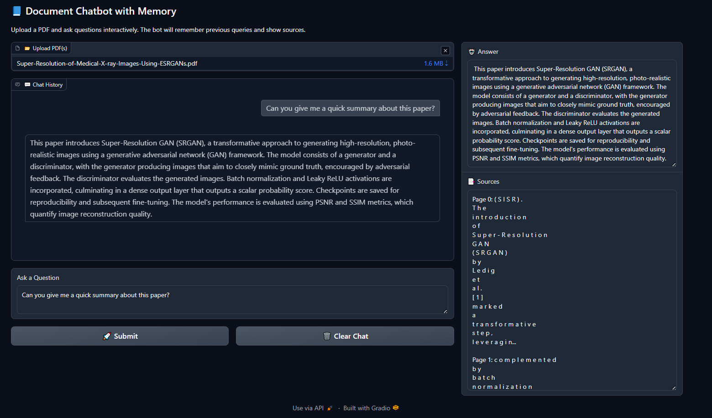

# 📘 Watsonx RAG Chatbot

An interactive **Retrieval-Augmented Generation (RAG) chatbot** built with **IBM Watsonx.ai, LangChain, ChromaDB, and Gradio**.  
The app allows users to upload PDFs and query them in natural language, with conversational memory and source citations.  

---

## 🚀 Features
- Upload one or multiple PDF documents.
- Split text into overlapping chunks using LangChain.
- Generate embeddings with **Watsonx Embeddings**.
- Store and retrieve vectors using **ChromaDB**.
- Conversational QA with memory using **Watsonx LLM**.
- Web-based UI built with **Gradio**.
- Displays sources/snippets for transparency.

---

## 🖼️ Screenshot


---

## 🛠️ Tech Stack
- **IBM Watsonx.ai** (LLM + Embeddings)
- **LangChain** (RAG pipeline, text splitting, conversational retrieval chain)
- **ChromaDB** (vector store)
- **Gradio** (UI for chatbot)
- **Python**

---

## 📂 Project Structure
📦 watsonx-rag-chatbot
┣ 📜 app.py # Main application
┣ 📜 cred.py # Credentials file (not uploaded – add your own)
┣ 📜 requirements.txt
┣ 📜 README.md
┗ 📷 screenshot.png

yaml
Copy code

---

## ⚙️ Installation
```bash
git clone https://github.com/yourusername/watsonx-rag-chatbot.git
cd watsonx-rag-chatbot
pip install -r requirements.txt
python app.py
📖 Usage
Run the app (python app.py).

Upload one or more PDFs.

Ask your questions in the chatbox.

Get AI-powered answers with sources.

🔮 Future Improvements
Add multi-language support

Enhance UI/UX

Support more vector DBs (Pinecone, Weaviate, FAISS)

Dockerize the app
